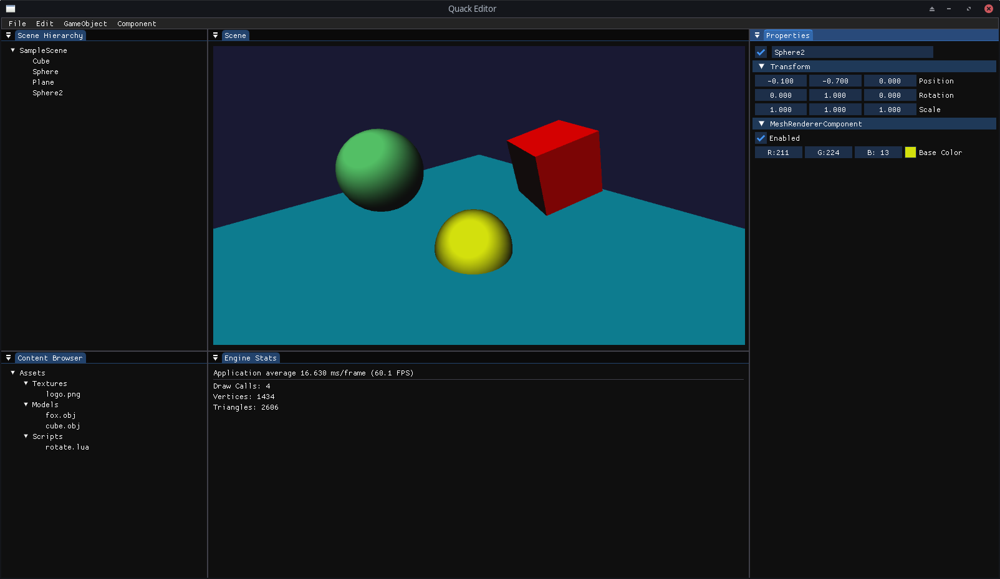

# Quack Engine

Quack Engine is a currently developed small 3D game engine created using C++ and OpenGL.



## Features
Since Quack Engine is still in development, it doesn't have many features. However, for now, it allows you to:
- create your own Engine-derived class with auto-called methods
- create a scene with objects to which you can connect components (Mesh, Camera)
- render pre-defined meshes (plane, cube, sphere)
- transform objects on the scene
- use global direction light applied to all objects
- load .obj files as meshes to render

## Usage Example
Code below shows a small example how to use the engine. Simple, work-in-progress documentation with described classes
is available [here](https://quackengine.netlify.app/annotated.html).
```C++
#include <Quack/Core/Engine.hpp>
#include <Quack/Core/Time.hpp>
#include <Quack/Graphics/Mesh.hpp>
#include <Quack/Scene/CameraComponent.hpp>
#include <Quack/Scene/MeshRendererComponent.hpp>
#include <Quack/Scene/Scene.hpp>

class Application final : public Engine {
public:
    Scene scene;
    GameObject* myCube = nullptr;

    // Called just after engine initialization
    void onCreate() override {
        // Create a game object and attach CameraComponent to it
        GameObject* camera = scene.createGameObject("Camera");
        camera->addComponent<CameraComponent>();
    
        // Create another game object
        myCube = scene.createGameObject("MyCube");

        // Set position of the cube object using its TransformComponent
        myCube->transform.position = {0, 0, -2};
        
        // Connect a MeshRendererComponent to created object, which will render on every update
        auto* meshRendererComponent = myCube->addComponent<MeshRendererComponent>();

        // Add a cube mesh to the MeshRenderer object
        meshRendererComponent->mesh = Mesh::createCube(); 

        // Create a shader program in the MeshRenderer object
        meshRendererComponent->shader.create("resources/shaders/unlit.vert", "resources/shaders/unlit.frag");

        // Set the blue color of the created object
        meshRendererComponent->material.baseColor = Color::Blue;

        // Start all game objects added to scene
        scene.startAllGameObjects();

        // Set window clear color (RGBA)
        accessWindow().setClearColor({0.2f, 0.3f, 0.3f, 1.f});
    }

    // Called every frame between clearing and updating
    void onUpdate() override {
        // Rotate the cube 60 degrees per second
        myCube->transform.rotation.y += 60.f * Time::getDeltaTime();
    
        // Update all objects added to the scene
        scene.updateAllGameObjects();
    }

    // Called just before engine destruction
    void onDestroy() override {
        // Free used resources
        for (auto& object : scene.getAllGameObjects()) {
            if (object->hasComponent<MeshRendererComponent>()) {
                auto* meshRenderer = object->getComponent<MeshRendererComponent>();
                meshRenderer->mesh.destroy();
                meshRenderer->shader.destroy();
            }
        }
    }
};

int main() {
    Application app;

    if (app.create(1024, 768, "Quack Engine Example")) {
        app.start();
    }

    app.destroy();

    return 0;
}
```

## Build Instructions
The project can be built using CMake. No external dependencies are needed since CMakeLists.txt
downloads all necessary libs. Build folder will contain two main outputs - `QuackEditor`
executable and `Quack` static library.

### Windows
```bash
mkdir build && cd build
cmake ..
cmake --build . --config Release
```

### Linux
```bash
mkdir build && cd build
cmake .. -DCMAKE_BUILD_TYPE=Release
cmake --build .
```

## Future features
- Mesh/Shader/Texture Manager
- Better shader abstraction compatible with materials
- Save/load scenes to/from file
- Save/load prefabs to/from file
- Light component with directional, point and spot light
- ScriptComponent and scripting (with Python or Lua)
- RigidBodyComponent with basic physics
- 2D support
- Own scripting language

## Future minor improvements
- Time scaling
- Fixed timestep
- Action mapping
- Mouse delta
- Gamepad support
